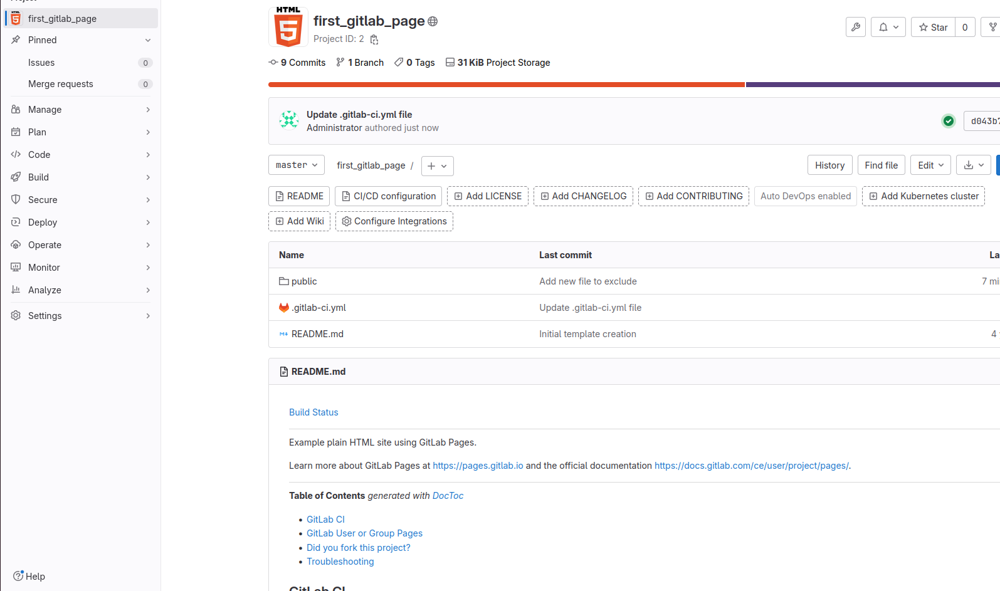
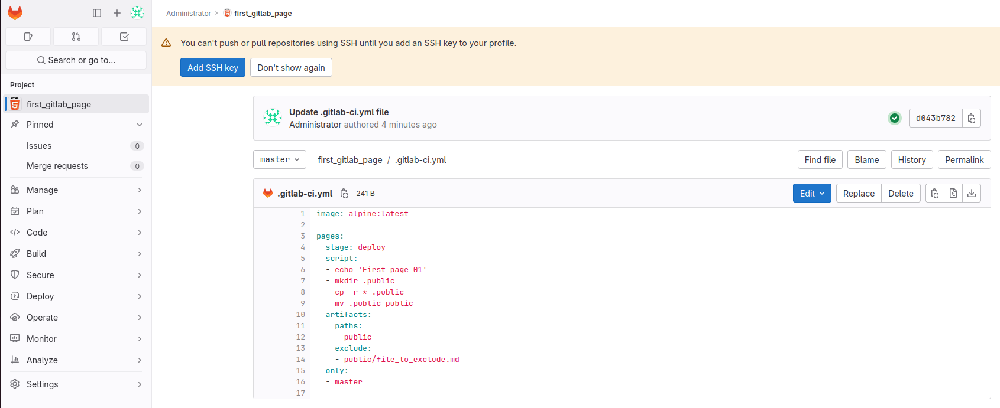
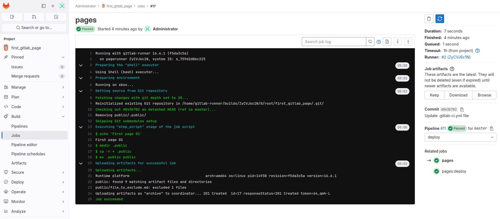
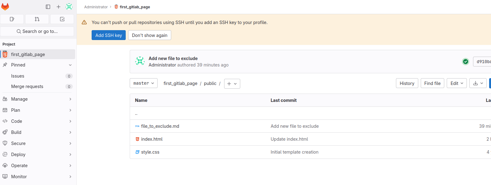

# CI/CD. Семинар 01

## Задача
1. Зарегистрироваться на gitlab.com
2. Создать pipeline и runner
3. Попробовать сохранить артефакт одной из стадий + исключить из папки с артефактами любой файл
4. Попробовать сделать любую gitlab pages

## Решение

Регистрация и настройка пайп были не сложными, ну на начальном этапе.

```yaml
image: alpine:latest

pages:
  stage: deploy
  script:
  - echo 'First page 01'
  - mkdir .public
  - cp -r * .public
  - mv .public public
  artifacts:
    paths:
    - public
    exclude:
    - public/file_to_exclude.md
  only:
  - master

```
Gitlab Runner пришлось разворачивать чрез кучу гуглений. В итоге настроил, зарегистрировал и запустил благодаря англоязычному ютубу. Интересно.

При настройке с инструциями yml файла при добавлении артефактов возникли сложности:
```yaml
...
  artifacts:
    paths:
    - public
    exclude:
    - public/file_to_exclude.md
...

```
4. gitlab pages тоже дались с трудом. Хотя, спустя кучу гугления и поиска вариантов решения все стартануло удачно. И файлы index.html и style.css были обработаны.


## Скриншоты





